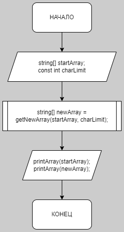
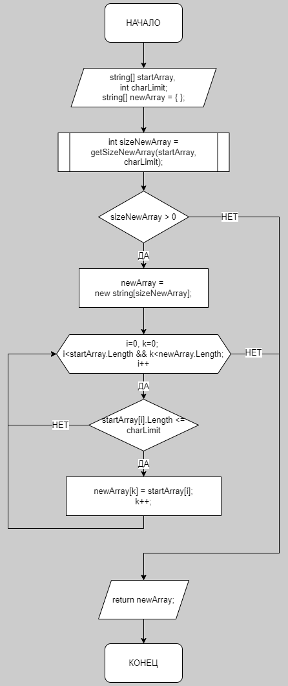
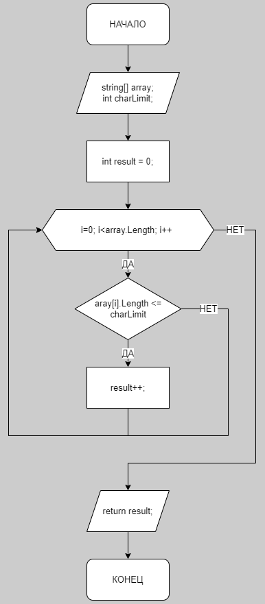

Пункт 1. Создать репозиторий на GitHub

Пункт 2. Нарисовать блок-схему алгоритма (можно обойтись блок-схемой основной содержательной части, если вы выделяете ее в отдельный метод)

Основное:

  

getNewArray:

  

getSizeNewArray:

  

Пункт 3. Снабдить репозиторий оформленным текстовым описанием решения (файл README.md)

Пункт 4. Написать программу, решающую поставленную задачу

Лежит в Program.cs

Пункт 5. Коммиты докинуты